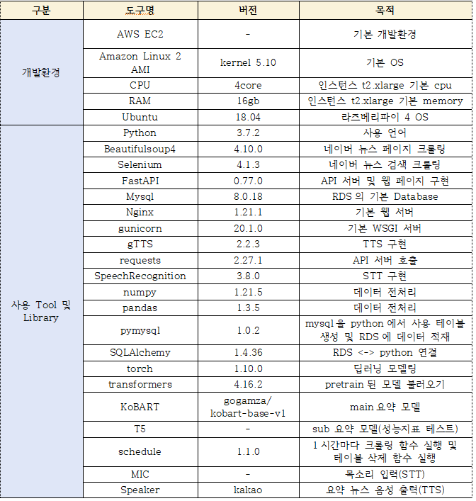

 # 뉴스 요약 AI speaker & 웹 사이트 NEWSSUM
 
 ### 기간  
 2022.5.2.~2022.6.7.  
 
 ### 내용   
 STT를 사용해 키워드, 뉴스 주제를 입력 후 해당 뉴스 요약문을 google TTS를 사용해 스피커로 출력 & FAST API를 사용 웹 페이지 구현  
 
 ### 상세 과정
 
1. 연예,스포츠,정치등 6개 분야 네이버 뉴스 6개의 기사 크롤링(beautifulsoup4) ‘xxx 키워드 검색‘ 입력시 xxx를 검색 후 관련 뉴스 크롤링(Selenium) 
2. 크롤링한 뉴스 기사 전처리 후 Kobart 모델링 후 요약기사 생성 
3. 기사 본문, 언론사, 요약 뉴스등 7개의 정보 RDS에 적재 
4. FastAPI로 뉴스 주제 음성 입력시 해당 주제 뉴스 기사 요약문 3개 or 검색하고 싶은 키워드 음성 입력시 해당 기사 요약문 1개를 response 하는 api 생성 
5. 라즈베리파이 4에 해당 api 호출 함수 생성 
6. 요약 뉴스 TTS 출력 
7. HTML & CSS 활용 FastAPI 웹 페이지 구현
 
 ### 사용 기술 stack
 
 

### 인원 및 역할
- 총원 5명 
- 역할 : 네이버 뉴스 크롤링, 뉴스 데이터 파이프라인 구축, 웹 서버 배포

### 상세 역할
**< part (1) : 네이버 뉴스 크롤링 >**  
   - beautifulsoup4 사용 네이버 뉴스(정치,경제,스포츠,연예,사회,생활/문화)기사 및 뉴스 분야, 기사 url, 언론등 7개 데이터 크롤링
   - 크롤링 한 뉴스 기사 원문 데이터 KoBART로 모델링 후 요약문 생성 
   - 크롤링한 데이터 + 요약문 RDS에 적재

**< part (2) : Raspberry Pi4 ↔ API 서버 연동 및 스피커 서비스 구현 >**
   - FastAPI에서 뉴스 주제, 키워드 검색시 요약문을 반환하는 api 생성
   - Raspberry Pi4에서 만들어진 api 호출 후 response된 요약문 tts로 출력하는 함수 생성  

**< part (3) : 웹 서버 생성 및 배포 >**
   - EC2 생성 후 서버 환경 구축
   - FastAPI로 만든 웹페이지 및 API AWS route53으로 도메인 등록 후 nginx로 배포

# 프로젝트 결과

## AI-Speaker & NewsSum 시연 영상

### 개선 사항
- T5 모델 사용시 주어가 생략되는 문제 해결 필요
- 시간, 날짜 단위 뉴스 출력 서비스 구현
- KoEletra와 같은 다른 요약 모델 성능 측정 및 모델링 구현 필요
- 영문 뉴스 번역 서비스로 확장 필요ㅕ 
